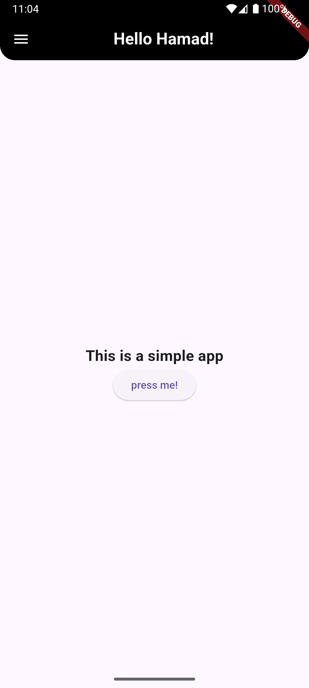
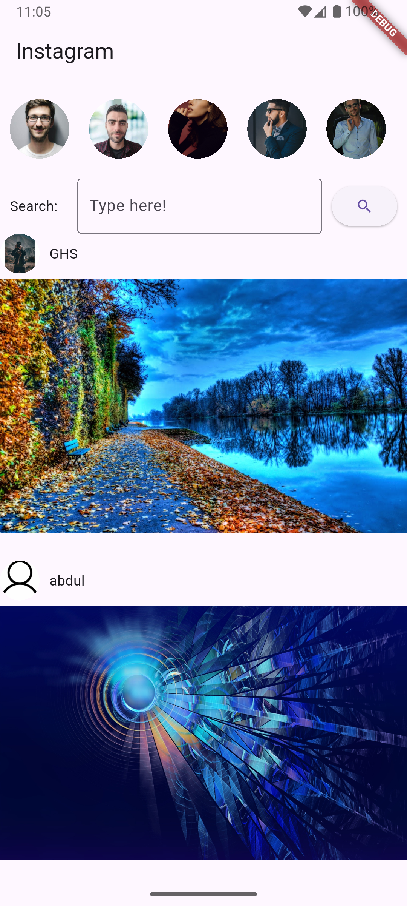
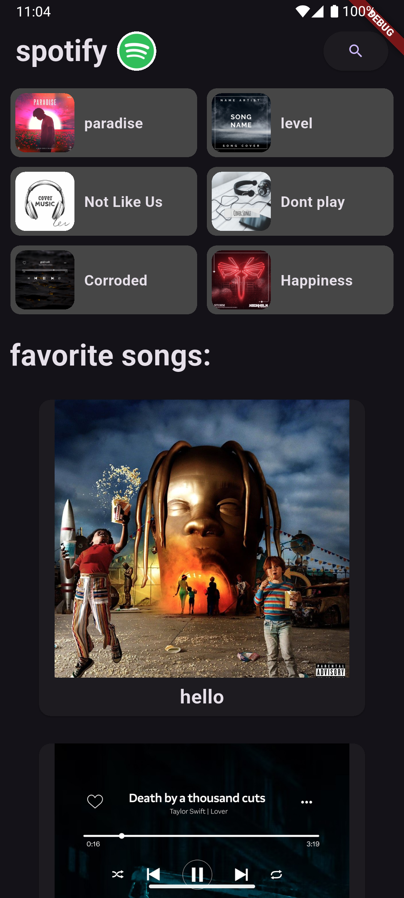
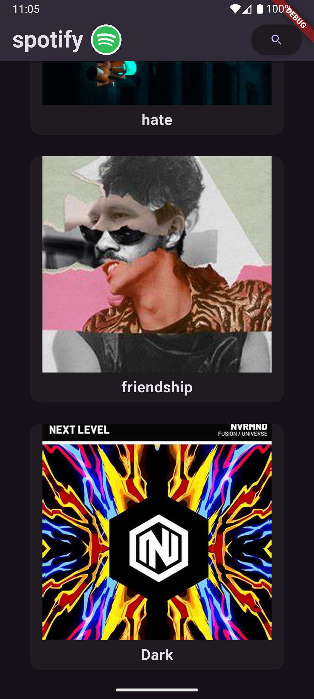

# Flutter Lab Tasks  

This folder contains three different Flutter UI tasks completed as part of my Flutter lab. Each task demonstrates various Flutter UI elements, including text fields, buttons, icons, nested widgets, and scrollable layouts.

---

## 📌 Task 1: Simple UI  
A basic Flutter interface featuring:  
- A **TextField** for user input  
- A **Button** for user interaction  
- Multiple **Icons** to enhance UI  

### Screenshot  
  

---

## 📌 Task 2: Instagram Clone (Static UI)  
A more complex UI resembling an Instagram-like interface.  
- **Nested Widgets** for structured layout  
- **Non-scrollable** design  
- Focused on UI positioning and styling  

### Screenshot  
  

---

## 📌 Task 3: Music App UI  
A scrollable UI for a music app.  
- **ListView** for dynamic scrolling  
- **Cards** to display music tracks  
- **Nested Widgets** for a structured layout  

### Screenshot  
  
---
 
---

## 📌 Notes  
- These tasks focus on **Flutter UI development** and do not include backend functionality.  

